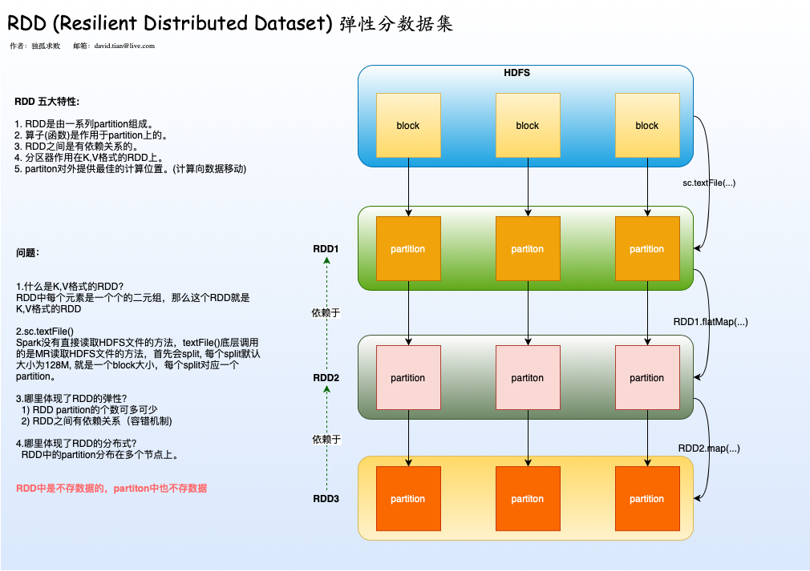
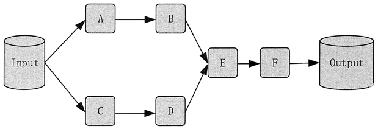

Spark核心之RDD详解

# 1.什么是RDD?
RDD(Resilient Distributed Dataset), 弹性分布式数据集。它是Spark提供的最重要的抽象概念，它是具有容错机制的特殊的数据集合，可以分布在集群的节点上，以函数式操作集合的方式进行各种并行操作。

# 2.RDD概述

## 2.1.RDD的五大特性

- RDD是由一系列partition组成
- 算子实际上是作用在partition上的
- RDD之间是有依赖关系的
- 分区器是作用在K,V格式的RDD上
- partition对外提供最佳的计算位置(计算向数据移动)

## 2.2.问题

- 1.什么是K,V格式的RDD?
RDD中的每个元素是一个个的二元组，那么这个RDD就是K,V格式的RDD

- 2.sc.textFile(): Spark底层没有直接读取HDFS文件的方法，textFile()底层调用的是MR读取HDFS文件的方法，首先会split, 每个split默认大小为128M, 就是一个Block大小，每个split对应一个partition。

- 3.哪里体现了RDD的弹性？
  - RDD中的partition的数量可多可少
  - RDD之间有依赖关系（容错机制）
  
- 4.哪里体现了RDD的分布式特点？
RDD中的partition是分布在多个节点上的。

- 5.实际上，RDD是逻辑的概念，里面是不存数据的，partition也是逻辑的概念，里面也是不存数据的

# 3.RDD的血缘关系(Lineage)

RDD 的最重要的特性之一就是血缘关系（Lineage )，它描述了一个 RDD 是如何从父 RDD 计算得来的。如果某个 RDD 丢失了，则可以根据血缘关系，从父 RDD 计算得来。
如下图所示：
系统从输入中逻辑上生成了 A 和 C 两个 RDD， 经过一系列转换操作，逻辑上生成了 F 这个 RDD，
Spark 记录了 RDD 之间的生成和依赖关系。当 F 进行行动操作时，Spark 才会根据 RDD 的依赖关系生成 DAG，并从起点开始真正的计算。

上述一系列处理称为一个血缘关系（Lineage），即 DAG 拓扑排序的结果。在血缘关系中，下一代的 RDD 依赖于上一代的 RDD。例如，上图中，B 依赖于 A，D 依赖于 C，而 E 依赖于 B 和 D。

# 4.RDD的基本操作
RDD主要提供三类算子来操作RDD：

- 转化操作(Transformation类算子)：转化类操作就是从一个RDD产生一个新的RDD, 懒执行类算子，需要Action类算子触发执行。
- 行动操作(Action类算子): 行动操作用于执行并按照指定的结果输出。行动操作接收RDD, 但返回非RDD,即输出一个值或都结果。
- 持久化(Persist类算子)：用于对RDD的操作进行持久化
